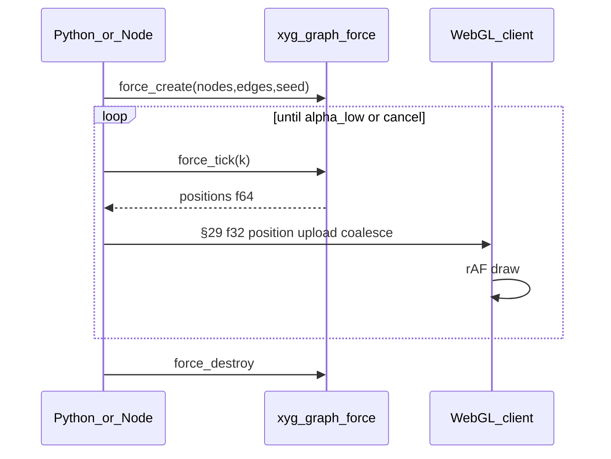

# Graph mark — design

**Status:** implementation design. Implements
[graph-fork-requirements.md](graph-fork-requirements.md) and
[host-parity.md](host-parity.md). Authoritative for the `graph` /
`graph_chart` surface, `xyg_graph_*` ABI, wire shape, layout ticks, and the
**render-graph** mental model below. Dual-host expectations:
[dual-host-parity-matrix.md](dual-host-parity-matrix.md).

---

## 1. Architecture — render-graph mental model

Graph visualization in XYG is not “dump V/E into WebGL.” Canonical graph data stays
host/CPU-side; **Rust** decides layout, viewport culling, graph LOD, edge LOD,
and encoding; the browser receives only **bounded §29 buffers** and paints
them through the **shared WebGL host**. Analysis algorithms stay in
GraphForge (and peers); this stack plots their outputs.

### 1.1 Pipeline

```text
GraphForge / canonical graph
        │  (opaque node/edge UUIDs, typed attrs, provenance, optional parents)
        ▼
Host Arrow adapter (Python or Node) → typed buffers/descriptors only
        ▼
Rust C ABI (`xyg_graph_*`)
  · layout (preset / grid / circle / force / …)
  · viewport windowing
  · graph LOD (clusters / reps / exact)
  · edge LOD (sample / aggregate / exact)
  · encode → offset f32 geometry + recorded §28 decisions
        ▼
Bounded §29 buffers + figure spec / render-graph descriptors
        ▼
Shared WebGL host (GLHost) — paint only
  · upload / draw / pick / gestures on shipped buffers
  · never re-derives LOD or force
```

| Stage | Owner | Emits |
|---|---|---|
| Analysis (paths, centrality, communities, …) | GraphForge / peers | Canonical tables / attributes |
| Ingest + id maps | Host (Python \| Node) | Pointers into Rust; tooltip id maps |
| Layout, viewport, graph LOD, edge LOD, encode | **Rust** | Positions, tiered geometry, §28 records, render-graph |
| Transport | Host | Spec + §29 blobs |
| Paint / hit-test / pan-zoom gestures | Shared WebGL client | Pixels only |

**Invariant:** Rust emits the **render graph** (which drawable layers, which
buffers, which recorded tier). The WebGL client does not invent tiers or
walk raw adjacency for drawing.

### 1.2 Complexity budget

| Stage | Budget | Notes |
|---|---|---|
| Ingest / CSR / id densify | **O(V+E)** | Once per graph (or structural edit); host→Rust handoff |
| Layout | **approx** | Exact FR only at small N; Barnes–Hut / grid approx at scale (§1.5) |
| Graph + edge LOD plan | **O(V+E)** | Viewport + budgets → tier; recorded (§28) |
| Interactive path | **≈ O(visible)** | Picks, neighbor highlight, drag; CSR on demand / shipped |
| GPU / paint | **≈ O(screen)** | Past direct tier: aggregates / density / sampled edges only |

Crossing a budget is never silent: every reduction is a recorded §28 decision
(same honesty rule as scatter LOD).

### 1.3 Boundary — never expose WebGL to raw V/E past direct tier

- **Direct-render tier only:** the client may hold one vertex/instance per
  visible node or edge, and only while `|V|` / `|E|` (or visible counts) sit
  under the Rust-owned direct budgets.
- **Above direct:** Rust **must** emit a render graph of aggregates —
  cluster centroids / representative nodes, density or bin surfaces, sampled
  or bundled edges — never the full adjacency list as GL buffers.
- Hosts and JS **must not** upload raw `V`/`E` “for the GPU to sort out.”
  If a path would ship unbounded topology to the browser, it is a bug.

This is the graph analogue of scatter’s density / pyramid tiers: the browser
stays screen-safe; truthfulness lives in recorded reductions + drill.

### 1.4 Zoom story

| Zoom | Node representation | Edge representation |
|---|---|---|
| **Far** | Clusters and/or density / aggregate surface | Aggregate or heavily sampled edges between clusters |
| **Mid** | Representative nodes (cluster reps / stratified keep) | Aggregate or sampled edges among reps |
| **Near** | Exact nodes (under budget / drilled window) | Exact edges (under budget / drilled window) |

Transitions follow scatter-class hysteresis and `drill_seq` versioning where
subsets ship ([lod-architecture.md](lod-architecture.md)); graph-specific
cluster membership stays available on the host for hover/drill identity.
Far and mid views are **honest aggregates**, not silent random drops.

### 1.5 Force layout at scale

- Default `layout="force"` is seeded Fruchterman–Reingold for small graphs
  (golden-tested across hosts).
- **Exact pairwise repulsion** when `n ≤ FORCE_EXACT_REPULSION_MAX_N` (**500**);
  above that, a deterministic spatial-grid Barnes–Hut-style cell approximation
  (exact within Moore neighborhood, monopole COM for distant cells). Seeded
  tests with `n ≤ ~64` always take the exact path.
- At scale: **Barnes–Hut** / **grid** force approximations — never
  naïve O(V²) on the interactive path.
- **Progressive ticks:** `force_create` → `force_tick(k)*` → `force_destroy`;
  hosts schedule on worker threads; uploads coalesce to animation frames.
- **Never on the JS main thread.** Force math is Rust-only; the client only
  paints position buffers it already received (§4).

### 1.6 Shared WebGL host inheritance

Graph marks do **not** invent a second GL stack. They inherit the upstream
document-scoped shared host:

- Design dossier **§18** — production `GLHost` (one detached WebGL2 context;
  charts blit into per-chart Canvas2D surfaces); governed per-chart fallback
  when `XY_SHARED_WEBGL` is off / unavailable / child-frame default.
- [renderer-architecture.md](renderer-architecture.md) — mark registry,
  uniform-only pan/zoom, §29 uploads; graph compiles to `segments` +
  `scatter` (+ graph meta / CSR), drawn by existing mark paths plus thin
  graph interaction (`58_graph.ts` when present).

Paint-only: the shared host never runs layout, LOD policy, or force.

---

## 2. Public API

```python
xyg.graph_chart(
    xyg.graph(
        nodes,              # ids, or table with id column
        edges,              # (source, target) pairs / columns
        *,
        x=None, y=None,     # preset positions (columns or arrays)
        layout="force",     # see §3 — single parameter, documented default
        color=None, size=None,  # node encodings
        edge_color=None, edge_width=None,
        directed=True,
        seed=0,
        iterations=300,
        ...
    ),
    ...
)
```

Node hosts mirror the same option names (TypedArrays / arrays).

**Encodings + hover (REQ-API-graph-channels):**

| Option | Scope | Wire |
|---|---|---|
| `color` | nodes (CSS string, length-`n_nodes` CSS list, or continuous numeric array) | constant style, `direct_rgba`, or `continuous` (unit f32 + colormap) |
| `size` | nodes (scalar px or length-`n_nodes` continuous values) | style.size or `size` continuous channel (`mode: continuous`, f32 unit buffer) |
| `edge_color` / `edgeColor` | edges | style or color channel on the segments trace |
| `edge_width` / `edgeWidth` | edges | style.width |
| `tooltip_rows` (post-compose on traces) or Node `nodeTooltipRows` / `edgeTooltipRows` | per-node / per-edge semantic dicts | `tooltip_rows` on the scatter / segments entries; length must equal **render-graph** `n_points` / geometry count (after `nodeBudget`/`edgeBudget`); filtered with finite-row selection on Python |

`tooltip_rows` are small-N JSON scalars (labels, ids, ranks, one numeric
readout per row) — not geometry — and therefore ride the spec rather than §29
buffers (same exception as Sankey in `chart-kind-contract.md`). Missing or
sparse rows are ignored at hover time; a length mismatch raises before shipping.
Encodings and tooltip rows are indexed in **render-graph** space, matching the
emitted scatter/segments lengths.

**Ingest (REQ-API-3):** xyg-native sequences, NumPy, pandas/Arrow columns,
edge lists, adjacency. `from_graphforge_tables()` / `fromGraphForgeTables()`
accept table-like named columns without requiring Arrow at package import.
Canonical GraphForge fields: `node_uuid`, `edge_uuid`, `src_uuid`/`source_uuid`,
`dst_uuid`/`target_uuid`, optional `parent_uuid`, `provenance_row`, plus leftover
typed columns (`labels`, `relationship_type`, properties).

For the GraphForge path, Rust owns canonical 16-byte node and edge UUIDs,
deterministic dense `u64` endpoints, directedness, and optional parent mapping
(opaque `GraphProjection` handle). Hosts coerce tables → packed UUID buffers,
then retain validated typed attribute columns and provenance on `GraphData`.
`graph()` / `composeGraph()` accept GraphForge tables or a ready `GraphData`
and attach `tooltip_rows` plus source-indexed `source_edge_ids` / provenance
meta. When render LOD keeps a 1:1 edge mapping, `edge_ids` mirrors
`source_edge_ids` and is render-aligned. `color=` / `size=` / `edge_color=` may
name projection columns. Generic graph ingest and `from_networkx()` remain
available and
compile to the same render pipeline. Browser/WASM identity round-trip for the
same projection handle remains under #59.

**Compile target:** one logical `graph` mark expands to a Rust-emitted
**render graph** whose leaf geometry is wire traces `segments` (edges) +
`scatter` (nodes), plus graph meta on the figure spec (`layout`, `n_nodes`,
`n_edges`, `directed`, neighbor CSR for highlight, recorded LOD). No
PROTOCOL bump required for MVP geometry; meta rides existing spec fields.

---

## 3. Index model (`u64`)

| Layer | Type |
|---|---|
| Public node IDs | `str` or `int` (host map) |
| Internal dense node / edge indices | **`u64`** in Rust ABI and CSR |
| Wire geometry | f32 positions/colors (§29); u64 index planes when shipped |

Never use `u32` for graph element identity — that ceiling already failed at
GraphForge / large-row scale.

Host keeps `id_to_index: dict` / `index_to_id: list` for tooltips and
selection callbacks. Rust never requires string IDs.

---

## 4. `layout=` catalog

Single parameter; default **`"force"`**.

| Name | Behavior |
|---|---|
| `preset` | Use provided `x`/`y` (required) |
| `grid` | Row-major grid |
| `circle` | Even circle |
| `force` / `fr` | Seeded Fruchterman–Reingold (default); exact pairwise ≤500, Barnes–Hut / grid approx above (§1.5) |
| `barnes_hut` | FR attraction + always grid BH repulsion |
| `spring` | Hooke spring–electrical (distinct `spring_k`; shares progressive tick handle) |
| `forceatlas2` / `fa2` | ForceAtlas2-style attraction, hub repulsion, gravity (seeded) |
| `linlog` | LinLog energy (FA2 with logarithmic attraction) |
| `yifanhu` | Yifan Hu–style: grid BH repulsion + edge springs |
| `kamada_kawai` / `kk` | Kamada–Kawai stress on all-pairs shortest paths; **n ≤ 500** (falls back to FR above) |
| `stress` | Stress majorization on graph distances; **n ≤ 500** (falls back to FR above) |
| `cose` | Deterministic CoSE-class default profile: ideal-edge springs, node repulsion, gravity, exact overlap pressure through the 500-node pairwise tier, deterministic de-overlap seeding above it, and stable disconnected-component spacing |
| `breadthfirst` | BFS layers from lowest-index root (or `roots=`) |
| `radial` | Distance rings from root (SHOULD) |
| `concentric` | Degree / attribute rings (SHOULD) |
| `dagre` / `hierarchical` | DAG layers (SHOULD) |
| `auto` | Heuristic: tiny→circle, DAG-like→breadthfirst, else force |

All future algorithms register as new `layout=` string values (REQ-LAY-6).

Force defaults: `seed=0`, `iterations=300`, `jitter` from seed. Golden tests
pin seeded FR output across Python and Node for the exact small-N path.
Progressive ticks (`force_create` + `algorithm` + `force_tick`) cover FR /
FA2 / spring / linlog / yifanhu at minimum; KK / stress share the same
handle for n ≤ 500.
`cose` uses that handle across native hosts. Python accepts snake-case option
keys in `cose={...}`; Node accepts the corresponding camel-case keys. Both
lower to one `XygCoseDescriptor` and `xyg_graph_force_create_cose`:

| Policy | Python key | Node key | Default / validation |
|---|---|---|---|
| ideal edge length | `ideal_edge_length` | `idealEdgeLength` | `1.0`, finite and > 0 |
| repulsion | `repulsion_strength` | `repulsionStrength` | `1.25`, finite and ≥ 0 |
| component gravity | `gravity_strength` | `gravityStrength` | `0.08`, finite and ≥ 0 |
| cooling multiplier | `cooling_factor` | `coolingFactor` | `0.985`, finite and strictly between 0 and 1 |
| overlap separation / ideal | `overlap_padding` | `overlapPadding` | `0.35`, finite and ≥ 0 |
| disconnected spacing / ideal | `component_spacing` | `componentSpacing` | `2.5`, finite and ≥ 0 |
| hard layout bounds | `bounds=(x0,y0,x1,y1)` | `bounds: [x0,y0,x1,y1]` | absent; finite, ordered bounds |

Unknown keys, invalid values, cyclic/self/out-of-range compounds, inconsistent
buffer lengths, and pins without authored initial positions fail closed. A pin
mask is node-indexed and preserves the authored f64 coordinate bit-for-bit;
pins outside authored bounds are rejected rather than moving silently.
GraphForge `parent_indices` plus validity lower to the canonical `u64::MAX`
root sentinel. Parent membership joins connected-component discovery and adds
a symmetric shorter containment spring inside the same Rust tick, so compounds
participate in repulsion, gravity, cooling, pins, and bounds. Parent validation
is O(V), including adversarial deep chains.
`overlap_padding` remains active in both scale tiers: the exact tier applies
pairwise separation, while the bounded grid tier applies the same pressure to
exact neighboring members and the mass-weighted cell representative for dense
neighbors. `run_layout`/`runLayout` validate the host-only iteration count
before stepping the Rust force handle; iterations are not transported in the
CoSE descriptor. Configured CoSE rejects non-positive counts rather than
silently discarding options, pins, or compounds through the one-shot path.

Direct browser CoSE now runs the same `ForceState` inside the static module
Worker through packed `XYGL` ingress and `XYGO` f64 checkpoints. A dedicated
worker returns one Rust tick as the initial phase, then advances in bounded
eight-tick chunks (configurable to 1..1000) separated by worker task turns.
Every job carries a monotonically increasing sequence plus a render revision;
supersession cancels and drops the old Rust state, mismatched revisions fail
with `STALE_REVISION`, and dispose terminates the worker within the existing
bounded lifecycle. The default 30 s wall limit is explicit and configurable;
the packed request and retained state must both fit the instance byte budget.
Multiple graphs use independent `XygWasmWorker` instances and therefore cannot
share layout state or replies. TypeScript validates ergonomic buffer shape and
option spelling, but Rust alone validates topology, options, pins, compounds,
bounds, and performs every force tick.
Node's progressive helper likewise defaults to a dedicated `worker_threads`
job; its cooperative `setImmediate` mode is explicit and reserved for batch or
test callers, never an interactive host default. The same one-tick initial
phase, bounded chunk size, render revision, cancellation signal, 30 s default
wall limit, and explicit initial/update/complete phases are visible to Node
consumers.

Python off-event-loop scheduling, drag/pin reheating and the full browser/native
deterministic tolerance plus first-paint/cadence size-ladder evidence remain the
explicit #35 closure gate. Hosts must not emulate the shipped CoSE policy.
Above the 500-node exact tier, repulsion uses a bounded uniform-grid
approximation: at most 32 members per neighboring cell are evaluated exactly;
denser neighboring cells and the complete far field are represented by mass
centres. A tick is therefore linear in node count for fixed neighborhood size,
rather than scanning every occupied cell for every node.

---

## 5. Progressive layout ticks (REQ-CORE-6)



Rules:

- All force math in Rust (exact or Barnes–Hut/grid approx); hosts only
  schedule ticks (thread / `worker_threads`).
- **Never run force on the JS main thread.**
- Coalesce uploads to animation frames; cancel drops the handle.
- First paint: `grid`/`circle` seed or N quick ticks, then refine.
- Same ABI for Python and Node → parity at scale.

---

## 6. LOD (scatter-class scale)

Align with xy scatter claims (10M / 100M / 1B-class **with** aggregation) and
the zoom story in §1.4:

| Regime | Behavior |
|---|---|
| Direct | Draw all nodes/edges under budget — sole tier that may expose per-element V/E to WebGL |
| Edge sample | Rust samples edges when edge count E is over budget; record §28 |
| Cluster / aggregate | Rust `xyg_graph_build_render` (and `xyg_graph_cluster_aggregate`) write centroids / reps when node count V exceeds `node_budget`, collapse multi-edges into cluster index space at Aggregate tier only, and record §28; Direct / EdgeSample keep parallels and self-loops; hosts keep `member_of` for drill / hover |
| Labels | Hide below zoom / over label budget |

Budgets and tier choice live in Rust decision helpers (render-graph emission);
hosts do not fork tier policy. Past direct tier, WebGL sees only the emitted
aggregates (§1.3).

---

## 7. Interaction

- Pan / zoom / fit (chart view) — zoom drives §1.4 LOD, not client-side
  topology walks.
- Pick nodes via scatter GPU pick; edges via segment hit or neighbor of picked node.
- Neighborhood highlight: CSR (`csr_offsets` / `csr_neighbors` u64 arrays on
  `spec.graph[]`) is consumed by the WebGL client. On hover of the graph's
  scatter (`node_trace`), the client builds a temporary `selBuf` mask
  (hovered node + CSR neighbors) and dims the rest through the existing
  point-shader `u_selActive` path; leave clears the mask. Durable
  box/lasso/rows selection still owns `selBuf` when active. On-demand
  `xyg_graph_neighbors` remains available for hosts that do not ship CSR.
- Drag nodes (SHOULD): write positions back through ABI / host buffer.
- Box select (SHOULD): reuse existing selection — graph node scatters
  participate as ordinary scatter traces (no separate path).
- Node shapes: via scatter `symbol=` (circle / square / …); no separate graph
  glyph ABI for MVP.
- `edge_curve` meta (`straight` default): recorded on graph meta for client
  follow-up. Rust `xyg_graph_edge_route_segments` owns Direct-tier paint
  geometry: deterministic parallel/reciprocal offsets, triangular self-loops,
  and optional directed arrowheads (`render_edge_index` maps each paint
  segment back to a render-graph edge). Bezier-class `curve` routing remains
  a follow-up; hosts must not invent offsets.

Interactive path is primary; export must not reshape the hot path (§8).
Geometry remains segments + scatter buffers from the render graph; the client
draws uploaded buffers only. Edge routing expands some edges into multiple
segments (loops / arrow wings) while preserving source edge identity via
`render_edge_index`.

---

## 8. Export

- HTML / WebGL interactive: primary (shared `GLHost`, §1.6).
- SVG: circles + polylines from screen-bounded positions (host SVG writer).
- Native PNG display-list graph ops: follow-up; do not block interactive MVP.

---

## 9. ABI sketch (`ABI_VERSION` bump with each signature change)

| Symbol | Role |
|---|---|
| `xyg_graph_layout` | One-shot layout → `out_x`/`out_y` f64 |
| `xyg_graph_force_create` | Handle for progressive force family; takes `algorithm: u32` (`LAYOUT_*`) |
| `xyg_graph_force_create_cose` | Configurable CoSE handle; packed options plus optional f64 positions, u8 pins, and u64 compound parents |
| `xyg_graph_force_tick` | Advance k steps; write positions |
| `xyg_graph_force_destroy` | Free handle |
| `xyg_graph_build_csr` | `offsets`/`neighbors` u64 CSR |
| `xyg_graph_sample_edges` | LOD edge index sample |
| `xyg_graph_lod_decision` | Recorded tier decision (§28) / render-graph inputs |
| `xyg_graph_cluster_aggregate` | LOD node centroid clusters + node→cluster membership + recorded tier |
| `xyg_graph_build_render` | Perceptually bounded render graph: centroids/`member_of` + cluster-space edges ≤ budgets; recorded §28 |
| `xyg_graph_projection_create` / `counts` / `copy_*` / `destroy` | Opaque canonical GraphForge identity/topology handle; validates UUID uniqueness, endpoints, optional parents, and resource bounds |

Element counts and indices are `u64` / `uint64_t`.

---

## 10. Module layout

```
src/graph/
  mod.rs       # public layout + force + csr + lod + render-graph decisions
python/xyg/
  _graph.py    # ingest helpers, id map, from_networkx thin
  marks.py     # graph() → layout/LOD ABI → segments + scatter
packages/xy-node/
  src/abi.js            # koffi loader over same cdylib
  src/graph.js          # normalize + runLayout (+ edge segments / meta)
  src/marks/            # scatter / line / histogram thin builders
  src/charts.js         # scatterChart / lineChart / histogramChart / graphChart
  src/figure.js         # minimal Figure + buildPayload (§29 subset)
  src/force_scheduler.js  # progressive ticks (setImmediate / worker_threads)
  src/sankey.js         # thin composeSankey
js/src/
  49_wasm_graph.ts  # packed CoSE request/checkpoint ergonomics
  wasm_worker.ts    # revision-safe progressive scheduling around Rust/WASM
  # shared GLHost paint; graph meta / CSR highlight only
```

Parity evidence: `tests/test_graph_node_parity.py` (4-node circle f64 + f32
bit-identical across Python and Node);
`tests/test_node_mark_parity.py` (scatter encode, M4 index count, histogram
counts).

Sankey and any other host-only layouts promote into Rust under the same
“Rust owns decisions” rule for dual-host MVP ([host-parity.md](host-parity.md)).
Placement of graph LOD / render-graph ownership is also recorded in
[rust-engine.md](rust-engine.md) §1.
