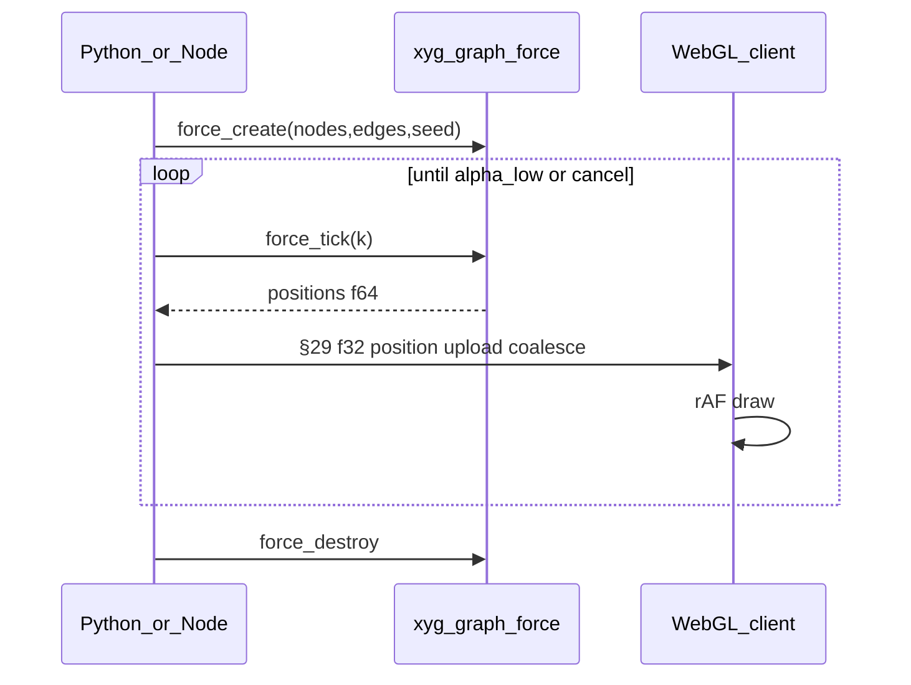

# Graph mark — design

**Status:** implementation design. Implements
[graph-fork-requirements.md](graph-fork-requirements.md) and
[host-parity.md](host-parity.md). Authoritative for the `graph` /
`graph_chart` surface, `xyg_graph_*` ABI, wire shape, layout ticks, and the
**render-graph** mental model below. Dual-host expectations:
[dual-host-parity-matrix.md](dual-host-parity-matrix.md).

---

## 1. Architecture — render-graph mental model

Graph visualization in XYG is not “dump V/E into WebGL.” Canonical graph data stays
host/CPU-side; **Rust** decides layout, viewport culling, graph LOD, edge LOD,
and encoding; the browser receives only **bounded §29 buffers** and paints
them through the **shared WebGL host**. Analysis algorithms stay in
GraphForge (and peers); this stack plots their outputs.

### 1.1 Pipeline

```text
GraphForge / canonical graph
        │  (opaque node/edge UUIDs, typed attrs, provenance, optional parents)
        ▼
Host Arrow adapter (Python or Node) → typed buffers/descriptors only
        ▼
Rust C ABI (`xyg_graph_*`)
  · layout (preset / grid / circle / force / …)
  · viewport windowing
  · graph LOD (clusters / reps / exact)
  · edge LOD (sample / aggregate / exact)
  · encode → offset f32 geometry + recorded §28 decisions
        ▼
Bounded §29 buffers + figure spec / render-graph descriptors
        ▼
Shared WebGL host (GLHost) — paint only
  · upload / draw / pick / gestures on shipped buffers
  · never re-derives LOD or force
```

| Stage | Owner | Emits |
|---|---|---|
| Analysis (paths, centrality, communities, …) | GraphForge / peers | Canonical tables / attributes |
| Ingest + id maps | Host (Python \| Node) | Pointers into Rust; tooltip id maps |
| Layout, viewport, graph LOD, edge LOD, encode | **Rust** | Positions, tiered geometry, §28 records, render-graph |
| Transport | Host | Spec + §29 blobs |
| Paint / hit-test / pan-zoom gestures | Shared WebGL client | Pixels only |

**Invariant:** Rust emits the **render graph** (which drawable layers, which
buffers, which recorded tier). The WebGL client does not invent tiers or
walk raw adjacency for drawing.

### 1.2 Complexity budget

| Stage | Budget | Notes |
|---|---|---|
| Ingest / CSR / id densify | **O(V+E)** | Once per graph (or structural edit); host→Rust handoff |
| Layout | **approx** | Exact FR only at small N; Barnes–Hut / grid approx at scale (§1.5) |
| Graph + edge LOD plan | **O(V+E)** | Viewport + budgets → tier; recorded (§28) |
| Interactive path | **≈ O(visible)** | Picks, neighbor highlight, drag; CSR on demand / shipped |
| GPU / paint | **≈ O(screen)** | Past direct tier: aggregates / density / sampled edges only |

Crossing a budget is never silent: every reduction is a recorded §28 decision
(same honesty rule as scatter LOD).

### 1.3 Boundary — never expose WebGL to raw V/E past direct tier

- **Direct-render tier only:** the client may hold one vertex/instance per
  visible node or edge, and only while `|V|` / `|E|` (or visible counts) sit
  under the Rust-owned direct budgets.
- **Above direct:** Rust **must** emit a render graph of aggregates —
  cluster centroids / representative nodes, density or bin surfaces, sampled
  or bundled edges — never the full adjacency list as GL buffers.
- Hosts and JS **must not** upload raw `V`/`E` “for the GPU to sort out.”
  If a path would ship unbounded topology to the browser, it is a bug.

This is the graph analogue of scatter’s density / pyramid tiers: the browser
stays screen-safe; truthfulness lives in recorded reductions + drill.

### 1.4 Zoom story

| Zoom | Node representation | Edge representation |
|---|---|---|
| **Far** | Clusters and/or density / aggregate surface | Aggregate or heavily sampled edges between clusters |
| **Mid** | Representative nodes (cluster reps / stratified keep) | Aggregate or sampled edges among reps |
| **Near** | Exact nodes (under budget / drilled window) | Exact edges (under budget / drilled window) |

Transitions follow scatter-class hysteresis and `drill_seq` versioning where
subsets ship ([lod-architecture.md](lod-architecture.md)); graph-specific
cluster membership stays available on the host for hover/drill identity.
Far and mid views are **honest aggregates**, not silent random drops.

### 1.5 Force layout at scale

- Default `layout="force"` is seeded Fruchterman–Reingold for small graphs
  (golden-tested across hosts).
- **Exact pairwise repulsion** when `n ≤ FORCE_EXACT_REPULSION_MAX_N` (**500**);
  above that, a deterministic spatial-grid Barnes–Hut-style cell approximation
  (exact within Moore neighborhood, monopole COM for distant cells). Seeded
  tests with `n ≤ ~64` always take the exact path.
- At scale: **Barnes–Hut** / **grid** force approximations — never
  naïve O(V²) on the interactive path.
- **Progressive ticks:** `force_create` → `force_tick(k)*` → `force_destroy`;
  hosts schedule on worker threads; uploads coalesce to animation frames.
- **Never on the JS main thread.** Force math is Rust-only; the client only
  paints position buffers it already received (§4).

### 1.6 Shared WebGL host inheritance

Graph marks do **not** invent a second GL stack. They inherit the upstream
document-scoped shared host:

- Design dossier **§18** — production `GLHost` (one detached WebGL2 context;
  charts blit into per-chart Canvas2D surfaces); governed per-chart fallback
  when `XY_SHARED_WEBGL` is off / unavailable / child-frame default.
- [renderer-architecture.md](renderer-architecture.md) — mark registry,
  uniform-only pan/zoom, §29 uploads; graph compiles to `segments` +
  `scatter` (+ graph meta / CSR), drawn by existing mark paths plus thin
  graph interaction (`58_graph.ts` when present).

Paint-only: the shared host never runs layout, LOD policy, or force.

---

## 2. Public API

```python
xyg.graph_chart(
    xyg.graph(
        nodes,              # ids, or table with id column
        edges,              # (source, target) pairs / columns
        *,
        x=None, y=None,     # preset positions (columns or arrays)
        layout="force",     # see §3 — single parameter, documented default
        color=None, size=None,  # node encodings
        edge_color=None, edge_width=None,
        directed=True,
        seed=0,
        iterations=300,
        ...
    ),
    ...
)
```

Node hosts mirror the same option names (TypedArrays / arrays).

**Encodings + hover (REQ-API-graph-channels):**

| Option | Scope | Wire |
|---|---|---|
| `color` | nodes (CSS string, length-`n_nodes` CSS list, or continuous numeric array) | constant style, `direct_rgba`, or `continuous` (unit f32 + colormap) |
| `size` | nodes (scalar px or length-`n_nodes` continuous values) | style.size or `size` continuous channel (`mode: continuous`, f32 unit buffer) |
| `edge_color` / `edgeColor` | edges | style or color channel on the segments trace |
| `edge_width` / `edgeWidth` | edges | style.width |
| `tooltip_rows` (post-compose on traces) or Node `nodeTooltipRows` / `edgeTooltipRows` | per-node / per-edge semantic dicts | `tooltip_rows` on the scatter / segments entries; length must equal **render-graph** `n_points` / geometry count (after `nodeBudget`/`edgeBudget`); filtered with finite-row selection on Python |

`tooltip_rows` are small-N JSON scalars (labels, ids, ranks, one numeric
readout per row) — not geometry — and therefore ride the spec rather than §29
buffers (same exception as Sankey in `chart-kind-contract.md`). Missing or
sparse rows are ignored at hover time; a length mismatch raises before shipping.
Encodings and tooltip rows are indexed in **render-graph** space, matching the
emitted scatter/segments lengths.

**Ingest (REQ-API-3):** xyg-native sequences, NumPy, pandas/Arrow columns,
edge lists, adjacency. `from_graphforge_tables()` / `fromGraphForgeTables()`
accept table-like named columns without requiring Arrow at package import.
Canonical GraphForge fields: `node_uuid`, `edge_uuid`, `src_uuid`/`source_uuid`,
`dst_uuid`/`target_uuid`, optional `parent_uuid`, `provenance_row`, plus leftover
typed columns (`labels`, `relationship_type`, properties).

For the GraphForge path, Rust owns canonical 16-byte node and edge UUIDs,
deterministic dense `u64` endpoints, directedness, and optional parent mapping
(opaque `GraphProjection` handle). Hosts coerce tables → packed UUID buffers,
then retain validated typed attribute columns and provenance on `GraphData`.
`graph()` / `composeGraph()` accept GraphForge tables or a ready `GraphData`
and attach `tooltip_rows` plus source-indexed `source_edge_ids` / provenance
meta. When every render edge is exactly one source edge (per the Rust
membership in §6), `edge_ids` is render-edge-indexed:
`edge_ids[r]` is the UUID of render edge `r`'s single source edge. `color=` / `size=` / `edge_color=` may
name projection columns. Generic graph ingest and `from_networkx()` remain
available and
compile to the same render pipeline. Browser/WASM identity round-trip for the
same projection handle is covered by the #59 foundation.

**Compile target:** one logical `graph` mark expands to a Rust-emitted
**render graph** whose leaf geometry is wire traces `segments` (edges) +
`scatter` (nodes), plus graph meta on the figure spec (`layout`, `n_nodes`,
`n_edges`, `directed`, neighbor CSR for highlight, recorded LOD). No
PROTOCOL bump required for MVP geometry; meta rides existing spec fields.

---

## 3. Index model (`u64`)

| Layer | Type |
|---|---|
| Public node IDs | `str` or `int` (host map) |
| Internal dense node / edge indices | **`u64`** in Rust ABI and CSR |
| Wire geometry | f32 positions/colors (§29); u64 index planes when shipped |

Never use `u32` for graph element identity — that ceiling already failed at
GraphForge / large-row scale.

Host keeps `id_to_index: dict` / `index_to_id: list` for tooltips and
selection callbacks. Rust never requires string IDs.

---

## 4. `layout=` catalog

Single parameter; default **`"force"`**.

| Name | Behavior |
|---|---|
| `preset` | Use provided `x`/`y` (required) |
| `grid` | Row-major grid |
| `circle` | Even circle |
| `force` / `fr` | Seeded Fruchterman–Reingold (default); exact pairwise ≤500, Barnes–Hut / grid approx above (§1.5) |
| `barnes_hut` | FR attraction + always grid BH repulsion |
| `spring` | Hooke spring–electrical (distinct `spring_k`; shares progressive tick handle) |
| `forceatlas2` / `fa2` | ForceAtlas2-style attraction, hub repulsion, gravity (seeded) |
| `linlog` | LinLog energy (FA2 with logarithmic attraction) |
| `yifanhu` | Yifan Hu–style: grid BH repulsion + edge springs |
| `kamada_kawai` / `kk` | Kamada–Kawai stress on all-pairs shortest paths; **n ≤ 500** (falls back to FR above) |
| `stress` | Stress majorization on graph distances; **n ≤ 500** (falls back to FR above) |
| `cose` | Deterministic CoSE-class default profile: ideal-edge springs, node repulsion, gravity, exact overlap pressure through the 500-node pairwise tier, deterministic de-overlap seeding above it, and stable disconnected-component spacing |
| `breadthfirst` | BFS layers from lowest-index root (or `roots=`) |
| `radial` | Distance rings from root (SHOULD) |
| `concentric` | Degree / attribute rings (SHOULD) |
| `dagre` / `hierarchical` | DAG layers (SHOULD) |
| `auto` | Heuristic: tiny→circle, DAG-like→breadthfirst, else force |

All future algorithms register as new `layout=` string values (REQ-LAY-6).

Force defaults: `seed=0`, `iterations=300`, `jitter` from seed. Golden tests
pin seeded FR output across Python and Node for the exact small-N path.
Progressive ticks (`force_create` + `algorithm` + `force_tick`) cover FR /
FA2 / spring / linlog / yifanhu at minimum; KK / stress share the same
handle for n ≤ 500.
`cose` uses that handle across native hosts. Python accepts snake-case option
keys in `cose={...}`; Node accepts the corresponding camel-case keys. Both
lower to one `XygCoseDescriptor` and `xyg_graph_force_create_cose`:

| Policy | Python key | Node key | Default / validation |
|---|---|---|---|
| ideal edge length | `ideal_edge_length` | `idealEdgeLength` | `1.0`, finite and > 0 |
| repulsion | `repulsion_strength` | `repulsionStrength` | `1.25`, finite and ≥ 0 |
| component gravity | `gravity_strength` | `gravityStrength` | `0.08`, finite and ≥ 0 |
| cooling multiplier | `cooling_factor` | `coolingFactor` | `0.985`, finite and strictly between 0 and 1 |
| overlap separation / ideal | `overlap_padding` | `overlapPadding` | `0.35`, finite and ≥ 0 |
| disconnected spacing / ideal | `component_spacing` | `componentSpacing` | `2.5`, finite and ≥ 0 |
| hard layout bounds | `bounds=(x0,y0,x1,y1)` | `bounds: [x0,y0,x1,y1]` | absent; finite, ordered bounds |

Unknown keys, invalid values, cyclic/self/out-of-range compounds, inconsistent
buffer lengths, and pins without authored initial positions fail closed. A pin
mask is node-indexed and preserves the authored f64 coordinate bit-for-bit;
pins outside authored bounds are rejected rather than moving silently.
GraphForge `parent_indices` plus validity lower to the canonical `u64::MAX`
root sentinel. Parent membership joins connected-component discovery and adds
a symmetric shorter containment spring inside the same Rust tick, so compounds
participate in repulsion, gravity, cooling, pins, and bounds. Parent validation
is O(V), including adversarial deep chains.
`overlap_padding` remains active in both scale tiers: the exact tier applies
pairwise separation, while the bounded grid tier applies the same pressure to
exact neighboring members and the mass-weighted cell representative for dense
neighbors. `run_layout`/`runLayout` validate the host-only iteration count
before stepping the Rust force handle; iterations are not transported in the
CoSE descriptor. Configured CoSE rejects non-positive counts rather than
silently discarding options, pins, or compounds through the one-shot path.

Direct browser CoSE now runs the same `ForceState` inside the static module
Worker through packed `XYGL` ingress and `XYGO` f64 checkpoints. A dedicated
worker returns one Rust tick as the initial phase, then advances in bounded
eight-tick chunks (configurable to 1..1000) separated by worker task turns.
Every job carries a monotonically increasing sequence plus a render revision;
supersession cancels and drops the old Rust state, mismatched revisions fail
with `STALE_REVISION`, and dispose terminates the worker within the existing
bounded lifecycle. The default 30 s wall limit is explicit and configurable;
the packed request and retained state must both fit the instance byte budget.
Admission conservatively includes both request copies, decoded columns,
`ForceState`, and the edge-heavy joined/undirected adjacency construction
high-water. A throwing progress callback rejects and cancels its job rather
than leaving Rust state or a consumer promise live.
The generated ABI manifest records every `XYGL`/`XYGO` header offset, flag,
count bound, and construction multiplier; reserved words must remain zero so
future formats cannot be misread as version 1.
Multiple graphs use independent `XygWasmWorker` instances and therefore cannot
share layout state or replies. TypeScript validates ergonomic buffer shape and
option spelling, but Rust alone validates topology, options, pins, compounds,
bounds, and performs every force tick.
Node's progressive helper likewise defaults to a dedicated `worker_threads`
job; its cooperative `setImmediate` mode is explicit and reserved for batch or
test callers, never an interactive host default. The same one-tick initial
phase, bounded chunk size, render revision, cancellation signal, 30 s default
wall limit, and explicit initial/update/complete phases are visible to Node
consumers. Native scheduling stops on Rust convergence and emits exactly one
completion phase rather than replaying no-op ticks through the requested cap.
Any unknown scheduler mode fails closed; only the exact, explicitly authored
`"immediate"` escape hatch can select caller-thread execution. Callback,
AbortSignal, and job identity shapes are rejected before allocating a Worker.

Python exposes a per-graph `GraphLayoutController` that owns one dedicated
worker thread and advances the same native Rust force handle in bounded chunks.
It delivers revision-tagged initial/update/complete checkpoints on the caller's
asyncio loop, cancels superseded jobs, rejects stale completion, and makes
disposal terminal. Independent controllers have independent queues and cannot
exchange revisions or positions. `reheat` restarts Rust CoSE from the current
drag coordinates and pin mask; Python transports those buffers but performs no
force or position math.

The full browser/native deterministic tolerance plus first-paint/cadence
size-ladder evidence remains an explicit #35 closure gate. Hosts must not
emulate the shipped CoSE policy.
Above the 500-node exact tier, repulsion uses a bounded uniform-grid
approximation: at most 32 members per neighboring cell are evaluated exactly;
denser neighboring cells and the complete far field are represented by mass
centres. A tick is therefore linear in node count for fixed neighborhood size,
rather than scanning every occupied cell for every node.

---

## 5. Progressive layout ticks (REQ-CORE-6)


```mermaid
sequenceDiagram
  participant Host as Python_or_Node
  participant Rust as xyg_graph_force
  participant Client as WebGL_client
  Host->>Rust: force_create(nodes,edges,seed)
  loop until alpha_low or cancel
    Host->>Rust: force_tick(k)
    Rust-->>Host: positions f64
    Host->>Client: §29 f32 position upload coalesce
    Client->>Client: rAF draw
  end
  Host->>Rust: force_destroy
```

Rules:

- All force math in Rust (exact or Barnes–Hut/grid approx); hosts only
  schedule ticks (thread / `worker_threads`).
- **Never run force on the JS main thread.**
- Coalesce uploads to animation frames; cancel drops the handle.
- First paint: `grid`/`circle` seed or N quick ticks, then refine.
- Same ABI for Python and Node → parity at scale.

---

## 6. LOD (scatter-class scale)

Align with xy scatter claims (10M / 100M / 1B-class **with** aggregation) and
the zoom story in §1.4:

| Regime | Behavior |
|---|---|
| Direct | Draw all nodes/edges under budget — sole tier that may expose per-element V/E to WebGL |
| Edge sample | Rust samples edges when edge count E is over budget; record §28 |
| Cluster / aggregate | Rust `xyg_graph_build_render` (and `xyg_graph_cluster_aggregate`) write centroids / reps when node count V exceeds `node_budget`, collapse multi-edges into cluster index space at Aggregate tier only, and record §28; Direct / EdgeSample keep parallels and self-loops; hosts keep `member_of` for drill / hover |
| Labels | Over-budget labels never paint; others paint from their Rust zoom threshold (§7.1 painted labels) |

Budgets and tier choice live in Rust decision helpers (render-graph emission);
hosts do not fork tier policy. Past direct tier, WebGL sees only the emitted
aggregates (§1.3).

**Edge membership (#33, ABI 367).** `xyg_graph_build_render` also emits CSR
source-edge membership per render edge when both optional outputs are
non-null: render edge `r` represents source edges
`members[offsets[r]..offsets[r + 1]]`, ascending. Direct and EdgeSample edges
have exactly one member; an Aggregate edge lists every source edge collapsed
into its ordered cluster pair. Source edges that are not painted (outside the
viewport, same-cluster at Aggregate, or sampled out) appear in no list, so no
tier attributes paint to an unrelated edge. Offsets need
`min(edge_budget, |E|) + 1` slots and members `|E|`. Membership is a host-side
identity plane (Python `GraphEdgeIdentity`, Node `createGraphEdgeIdentity`): it
is never serialized into `spec.graph` or the paint payload.

---

## 7. Interaction

- Pan / zoom / fit (chart view) — zoom drives §1.4 LOD, not client-side
  topology walks.
- Pick nodes via scatter GPU pick; edges via segment hit or neighbor of picked node.
- Edge identity (#33): the edge trace's per-segment `tooltip_rows` follow the
  §6 membership, not a count comparison. A render edge with one member carries
  that source edge's projection row (`edge_id`, endpoints, provenance, attrs);
  an Aggregate edge carries `{edge_count}` and never one invented source edge.
  The browser's local hover/click rows therefore show the exact UUID or the
  aggregate count. A pick of an edge segment (Python `pick` / `click` comm
  reply; Node `Figure.graphEdgePick(trace, segment)`) adds `render_edge`,
  `edge_count`, `source_edges`, `edge_ids` (when UUIDs exist) and
  `members_truncated`, listing at most `GRAPH_EDGE_PICK_MEMBER_CAP` (256)
  members in ascending source order. Python and Node share one cross-host
  fixture (`tests/fixtures/graph_edge_identity_cross_host.json`), and a
  Chromium probe hovers every routed segment to check the browser row carries
  the same identity.
- Neighborhood highlight: CSR (`csr_offsets` / `csr_neighbors` u64 arrays on
  `spec.graph[]`) is consumed by the WebGL client. On hover of the graph's
  scatter (`node_trace`), the client builds a temporary `selBuf` mask
  (hovered node + CSR neighbors) and dims the rest through the existing
  point-shader `u_selActive` path; leave clears the mask. Durable
  box/lasso/rows selection still owns `selBuf` when active. On-demand
  `xyg_graph_neighbors` remains available for hosts that do not ship CSR.
- Drag nodes (SHOULD): write positions back through ABI / host buffer.
- Box select (SHOULD): reuse existing selection — graph node scatters
  participate as ordinary scatter traces (no separate path).
- Node shapes: via scatter `symbol=` (circle / square / …); no separate graph
  glyph ABI for MVP.
- `edge_curve` meta (`straight` default, `curve` for Bezier-class routing):
  recorded on graph meta and consumed entirely in Rust — hosts pass the
  option through and never invent offsets or geometry. Rust
  `xyg_graph_edge_route_segments` owns Direct-tier paint geometry:
  deterministic parallel/reciprocal offsets (ranked by source edge index
  within the undirected endpoint bundle and applied along the bundle's
  canonical low→high-node normal, so a reversed edge never mirrors onto a
  sibling's route), triangular self-loops, optional
  directed arrowheads, and (`curved=true`) quadratic-Bezier shafts tessellated
  into `CURVE_TESSELLATION_SEGMENTS` (8) deterministic straight sub-segments
  per edge (`render_edge_index` maps every paint segment, including curved
  ones, back to a render-graph edge). The control point bows perpendicular to
  the chord by the same rank-based amount used for straight-edge separation
  (or a small deterministic default for unbundled edges), so reciprocal and
  parallel curved edges fan out just like their straight counterparts; the
  arrowhead orients along the final tessellated tangent rather than the chord.
  Host route buffers are sized per mode by `edge_route_segments_per_edge`:
  `EDGE_ROUTE_SEGMENTS_PER_EDGE` (10) when curved (8 shaft pieces + 2 arrow
  wings) and `STRAIGHT_EDGE_ROUTE_SEGMENTS_PER_EDGE` (3) when straight (a
  3-sided loop, or shaft + 2 wings), so straight graphs never pay the curved
  ceiling. Per-edge encodings (color, width, tooltips) are render-edge indexed
  and every host expands them across routed segments via `render_edge_index`.
- **Border-aware ends and screen-space arrowheads (#33, ABI 368).** Graph
  marks route through `xyg_graph_edge_route_ends`: the same geometry without
  data-space arrow wings (1 shaft per straight edge, 3 loop sides,
  `CURVE_TESSELLATION_SEGMENTS` curved pieces), plus per-segment `edge_ends`
  (7 values: source-node center minus the piece start in data units, source
  radius px, target-node center minus the piece start, target radius px, and
  a flag byte: head `0x40` on every piece of a directed edge, terminal `0x20`
  on its last piece, target shape bits 0-1, source shape bits 2-3). Centers
  ride as deltas from the piece start so f32 transport stays exact. Hosts pass
  each render node's on-screen radius (half the diameter the node scatter
  ships, including continuous `size` over its `range_px`) and scatter symbol
  code; circle, square, and diamond clip exactly, every other symbol clips to
  its circumscribed circle. Painters clip **every piece** against both node
  outlines in screen space (`edge_route::clip_edge_piece` /
  `node_shape_span`), so parallel/reciprocal shafts offset from the centers
  and short curve pieces near large nodes still start and end on the
  outline. The piece that enters the target outline draws a filled
  `GRAPH_EDGE_HEAD_LENGTH_PX` (8) × 2·`GRAPH_EDGE_HEAD_HALF_WIDTH_PX` (4) head
  with its tip on the outline; if a shaft misses the target entirely, its
  terminal piece draws the head at its end. A piece inside a node is hidden;
  a shaft is only shortened for a head that is actually drawn. The WebGL
  segment shader applies the rule every frame (radii × dpr × the node
  scatter's zoom size factor × its entrance-animation scale), and hover uses
  the same clip. The static Scene applies it once at encode (scene-ir.md
  `EdgeSegment`); hosts ship `edge_ends` as a host-computed geometry channel
  that static admission does not treat as per-item paint. Polar keeps
  untrimmed edges. Parallel separation (0.08) and loop radius are still data
  units, so collinear layouts can spread parallel edges widely.

Interactive path is primary; export must not reshape the hot path (§8).
Geometry remains segments + scatter buffers from the render graph; the client
draws uploaded buffers only. Edge routing expands some edges into multiple
segments (loops / curve tessellation) while preserving source edge identity via
`render_edge_index`.

### 7.1 Label, visual-state, and compound foundation (#34)

`graph_style` is the single policy owner for three host-neutral decisions:

- `xyg_graph_label_accept` ranks finite label priorities, uses stable source
  index as the tie-breaker, and applies a viewport budget and optional floor;
- `xyg_graph_visual_state_resolve` applies disabled, filtered, selected,
  hovered, neighbor, pinned, aggregate, then normal precedence; and
- `xyg_graph_compound_bounds` preserves each child's dense identity while
  emitting direct parent membership and transitive descendant AABBs. The validity plane alone
  governs membership: invalid parent payload is ignored, including canonical
  zero-filled `GraphProjection` slots; `NO_COMPOUND` is an output sentinel.

Node exposes thin typed-array utilities; Python exposes equivalent private
`_native` utilities. Canonical `graph()` composition in both hosts now calls
those utilities for Direct-tier nodes and records `node_labels`,
`label_accepted`, `visual_states`, `parent_of`, `compound_nodes`, and
`compound_bounds` in `spec.graph`. The default label fallback is the `label`
column, then `name`, then canonical node identity. Identity fallback accepts
strings and exact integers in the shared JavaScript safe range; unsafe
integers, non-finite numbers, booleans, bytes, and object identities produce
no label candidate without invalidating the graph. Label cells are either
strings or null; null advances through that fallback chain, while booleans,
numbers (including non-finite values), bytes, and objects fail closed instead
of receiving host-language-specific stringification. A missing candidate gets
a non-finite priority before the Rust acceptance call, so it cannot consume
the viewport budget. The default budget is
64 (hard maximum 4096), rejected labels serialize as `null`, accepted strings
are limited to 4096 UTF-8 bytes, and equal priorities retain source order.
Aggregate LOD intentionally omits
source-indexed style metadata rather than attaching it to cluster identities.

**Painted labels on the composed mark (#34, ABI 371).** Composed `graph()`
paints node and edge labels in the browser from one Rust plan,
`xyg_graph_label_plan` (`graph_style::graph_label_plan`). Hosts pass every
candidate: nodes (label text, `label_priority`, resolved visual state, marker
radius) and edges (`edge_label` / `edge_label_priority`, Python and Node
camelCase; no default edge label), each edge anchored at the midpoint of the
middle routed piece of a single-member render edge, as in the Scene. Rust then
decides everything:

- candidates need a finite priority at or above `label_priority_floor`, a
  nonempty label, and a state other than aggregate or filtered;
- `label_budget` (default 64, maximum 4096) keeps the highest priorities
  across nodes and edges together;
- labels keep at most 32 characters (31 plus "…"); hosts apply the returned
  `keep` count mechanically;
- the box model is the Scene's: 12 px face, 0.62 em advance, baseline 4 px
  right of a node marker or 4 px above an edge anchor;
- accepted labels are ordered by visual state (descending, as the Scene),
  priority, then input order, and each gets a **zoom threshold**: the
  smallest isotropic scale (screen px per data unit) from which it no longer
  overlaps any higher-ordered label that is itself visible there. Zooming in
  therefore only adds labels, and painted labels never overlap.

The plan ships as a per-item `label_plan` placement channel
(`threshold`, `offset_x`, `offset_y`, planned `width`, `font_px`; threshold −1
never paints) on the node trace and, per anchor segment, on the edge trace,
with `node_labels` and `edge_label_segments`/`edge_label_text` in
`spec.graph`. The browser paints a label when `min(sx, sy)` (CSS px per data
unit) reaches its threshold, at its anchor plus the Rust offset, at the
planned font size and fitted into the planned width (canvas `maxWidth`), so a
wide page font can never push text past its collision box; it is clipped to
the plot. With anisotropic scales the threshold test is conservative (never
overlapping). The plan assumes linear axes, so a graph on log or symlog axes
paints no labels, and a legend-hidden node or edge trace paints none of its
labels. The client adds no placement, collision, or truncation policy. `label_plan` is placement, not per-item paint, so labeled
graphs keep static export; static SVG/PNG do not paint composed-graph labels
yet (the semantic Scene route does). `tests/test_graph_label_plan.py` pins the
plan in `tests/fixtures/graph_label_plan_cross_host.json` (Node asserts the
same fixture) and probes Chromium for non-overlapping labels that multiply
when zoomed; a Rust property test checks collision freedom and monotonicity
across scales.

The direct semantic Scene now paints node and edge label text. Rust ranks the
resolved visual state with stable source identity as its tie-breaker, omits
aggregate/filtered labels, truncates to a bounded 32-character/plot-width
budget, greedily rejects overlapping screen boxes, and emits final position,
font, paint, text, and source identity. Browser, SVG, and raster consumers do
not repeat acceptance, collision, or truncation. The canonical native compound
Scene seam is exposed in ABI 89 as `xyg_graph_compound_scene`; thin Python and
Node authoring helpers pass exact source planes and receive canonical Scene
bytes (current `SCENE_VERSION`). Parent, validity, and collapse planes must each equal node count; short
and trailing values fail closed before traversal. The seam additionally accepts strict parent-validity and collapse planes.
Rust validates the entire acyclic forest before output, leaves a collapsed
group visible, hides all descendants, maps crossing edges to the nearest
visible collapsed ancestor, omits edges that become internal, propagates
hidden selected/hovered/neighbor/pinned state to the representative, and emits
visible transitive group bounds as Rect primitives. Stable node/edge source
identity is unchanged. Direct-WASM authoring uses the same compiler through
XYGG v3; TypeScript only frames the three exact planes and does not synthesize
collapse policy.

ABI 90 adds `xyg_graph_compound_transition`, the public disclosure-state
transaction. A host supplies exact stable node IDs plus `node_count` values in
each canonical `parents`, `parent_validity`, and `collapsed` plane, in that ABI
order, followed by a target ID and expand/collapse/toggle. Rust validates the
whole forest, rejects duplicate/missing/non-group targets and every non-Direct
LOD tier, and copies the next collapse plane only after all checks succeed.
The operation is bounded to 1,024 source nodes; thin hosts do not traverse the
hierarchy or decide aggregate eligibility.
Direct-browser callers use the public `transitionWasmCompound` task and feed
its returned plane back through ordinary semantic Scene compilation. This
keeps ChartView lifecycle, WebGL identity, and DOM accessibility plumbing in
the browser while the disclosure and LOD decision remains Rust-owned.

#### 7.1.1 Versioned GraphForge resolved style v1

ABI 87 adds `xyg_graph_semantic_style_resolve(version=1, theme)`. It is the sole
resolver for the closed canonical numeric planes `class`, `epistemic`,
`status`, `metric`, and interaction flags, for both nodes and edges. Codes are
bounded to `0..=7`; an unknown code or mismatched plane rejects the entire
call before any output changes. Rust computes the finite metric domain and
overflow-safe linear clamped size/width scale, applies the §7.1 state precedence to actual
paint, and emits fill/stroke/halo RGBA, node size/shape, edge width/dash/arrow,
opacity, and resolved state. Hosts serialize these painter values and do not
recreate palettes, domains, ordering, or state overlays.

The v1 class, epistemic, and status tables use explicit light and dark
color-blind-safe vocabularies with a neutral zero value. Every palette color
and the theme-specific selected overlay has measured WCAG 2.x non-text
contrast of at least 3:1 against its declared background (`#fff` light,
`#111827` dark); Rust fixtures resolve and composite every active
theme × node/edge × winning-state style and enforce that property for emitted
fill, stroke, and halo. Filtered (`0.08`) and disabled (`0.28`) are deliberate
inactive-state opacity exemptions and make no contrast claim. Selected uses a
theme-opposite stroke; hovered and neighbor have distinct width deltas; pinned
has a larger width plus an edge dash; aggregate has its own node shape and edge
dash. Unknown interaction bits fail the complete resolution atomically. Rust also owns
`xyg_graph_semantic_legend`: its capacity-safe query/copy ABI de-duplicates
present values and emits stable field-then-code order with the exact resolved
theme palette and class shape descriptor. Python and Node only materialize
those returned descriptors.

The direct-browser/export seam accepts packed `XYGG` v3 for the **direct tier
only**. TypeScript checks representation, aligned lengths, closed codes, and
the 1,024-element ingress ceiling, then transfers canonical f64 coordinates,
u64 endpoints, semantic planes, and exact compound planes. Rust resolves the
compound forest and node/edge paint, expands
halo rings, screen-space dash spans, and arrowheads, and emits at most 1,024
painter traces plus bounded label primitives in the canonical Scene. Source-indexed semantic planes are
rejected for aggregate LOD rather than being attached to cluster identities.
The same Scene bytes drive direct-WASM WebGL, native SVG, and native
raster/PNG, including the Rust-ordered `Class`, `Epistemic`, and `Status`
legend. No browser or export renderer owns a second palette, state, dash,
arrow, legend, label collision, or truncation policy.

Every expanded edge layer, dash span, loop segment, and arrow wing retains the
one source-edge stable ID; a separate paint-identical style/run boundary keeps
disconnected primitives disconnected without manufacturing identities. Rust
rejects viewports above 16,384 px per side and charges every expanded primitive
before allocation or append. The Scene also carries opaque theme-owned chart
and plot backgrounds plus axis/grid/label chrome for both light and dark.

Aggregate-specific semantic summaries remain follow-up work; aggregate
omission is already enforced at this seam.

#### 7.1.2 Public semantic mapping on the composed graph mark (#34)

The public composition API names the v1 planes directly. Python
`graph(...)` / `graph_chart(...)` accept `node_class`, `node_epistemic`,
`node_status`, `node_metric`, `edge_class`, `edge_epistemic`, `edge_status`,
`edge_metric`, and `theme` (`"light"` | `"dark"`); Node `graph` /
`graphChart` accept the camelCase names (`nodeClass`, …, `theme`) and the
snake-case aliases. Each is an array or a validated node/edge column name.
Codes are exact integers `0..=7`; an unset code plane is all zeros and an
unset metric is all zeros. Unknown columns, non-integer or out-of-range codes,
length mismatches, unknown themes, mixing semantic fields with explicit
node `color`/`size` or `edge_color`, and a mark `style` that would override
resolved paint (node fill, opacity, stroke, stroke width, shape, fill/stroke
opacity; edge color, width, opacity) all fail closed before layout output.
Code ranges are checked on every source row even when Aggregate LOD later
omits the paint.

Hosts call `xyg_graph_semantic_style_resolve` once per side over **source**
rows (nodes with the §7.1 visual-state flags from `visual_state_flags`; edges
with zero flags) and never compute palette, scale, or state policy. Resolving
over every source edge keeps the metric domain the source domain, so an
EdgeSample tier does not rescale kept edge widths. The resolved rows map onto
the existing painter channels:

| Resolved field | Composed paint |
|---|---|
| node `fill_rgba` | scatter direct-RGBA fill |
| node `stroke_rgba`, `width` | scatter direct-RGBA stroke, per-node stroke width |
| node `size` (px diameter) | per-node size with an identity pixel mapping; also the border radius for Rust edge trims |
| node `shape` (`class % 6`) | per-node symbol (circle, square, diamond, triangle, cross, hexagon); also the edge-trim outline code |
| node/edge `opacity` | per-item opacity (renderer uniform stays 1) |
| edge `stroke_rgba`, `width` | per-segment direct-RGBA color and width, gathered through the render-edge membership and expanded across routed segments |

The ordered paint layers come from one Rust lowering,
`graph_style::semantic_paint_layers` (ABI 369
`xyg_graph_semantic_paint_layers`), which the canonical semantic Scene also
uses, so neither consumer owns halo, body, dash, or arrow policy. Layer colors
carry the row opacity and layer alpha (halo 0.38); an all-zero color is an
absent layer, and an absent layer ships no channel.

| Layer (Rust rule) | Composed paint |
|---|---|
| node halo: epistemic ≠ 0, circle at size + 7 px | scatter `halo_rgba` (u8×4) + `halo_size` (CSS px); a circle with no stroke immediately under its node |
| edge halo: epistemic ≠ 0, width + 5 px | segments `halo_rgba` + `halo_width` |
| edge class body: class ≠ 0, width + 2 px | segments `body_rgba` + `body_width` |
| edge status stroke | the stroke above |
| edge dash: code → (6, 4), (2, 3), (10, 4) px; pinned 3, aggregate 2 | segments `edge_dash` (on, off) CSS px, applied to every edge layer and measured along each routed piece from its start, like the Scene; arrowheads are never dashed |
| edge arrow: status ≠ 0 | the `edge_ends` head bit (0x40) per segment; replaces the `directed` default for semantically styled edges |

Paint order matches the Scene item by item: the point program draws two
instances per node (data attributes at divisor 2: halo, then node) and the
segment program three per edge segment (divisor 3: halo, body, stroke), each
instance naming its layer through a per-instance layer attribute. Dash and
layer widths share one vec4 per segment so the segment program stays within
16 vertex inputs including `gl_VertexID`, which some SwiftShader/ANGLE builds
count as an attribute (`tests/test_shader_attribute_budget.py` holds every
client vertex shader to that budget), so each item
finishes its layers before the next item paints and a later edge's halo covers
an earlier edge's stroke at a crossing. Filled arrowheads remain one pass over
all edge layers. The Scene bounds very long dashed pieces to 64 periods to cap
primitive expansion; the WebGL pass expands nothing, so it keeps the authored
period at every length.

A semantically styled node scatter is pinned to direct draw (Python
`density=False`, Node `forceDirect`): the density surface would drop per-node
size, shape, stroke, and opacity, so `style_contract.nodes = "resolved"`
always means painted. Source rows paint only where render identity is exact: nodes when the render
graph keeps every node (Direct, EdgeSample), edges when every render edge has
exactly one member (§28 membership). Under Aggregate LOD that side is omitted.
Every styled graph records `spec.graph.style_contract` =
`{version: 1, theme, nodes, edges, pending_layers, node_metric_domain?,
edge_metric_domain?}` with `nodes`/`edges` one of `"resolved"`,
`"omitted:aggregate"`, or `null` (not requested). `pending_layers` lists v1
layers the canonical Scene paints but the composed mark does not; it is empty
now that every layer paints, and hosts and clients must never treat a listed
layer as drawn. Static
SVG/PNG export of a semantically styled composed graph fails closed with
`XYG_SCENE_UNSUPPORTED_GRADIENT` (per-item paint is not admitted by the static
Scene route yet) in both hosts; interactive HTML, notebook, and Reflex output
paint it. `tests/test_graph_semantic_mapping.py` pins the painted values in
`tests/fixtures/graph_semantic_mapping_cross_host.json` across Direct,
curved, EdgeSample, and Aggregate cases; `packages/xy-node/test/graph.test.mjs`
asserts the same fixture (including every layer channel and head bit), and
browser probes read the resolved fills, the ordered stroke/body/halo rings,
dash gaps, node halos, and per-edge layer order at a crossing back from WebGL.

#### 7.1.4 Color scales and the semantic legend (#34, ABI 372)

`graph(color_scale=..., edge_color_scale=...)` (Node `colorScale` /
`edgeColorScale`) chooses how an array `color` / `edge_color` maps to paint.
Each is a dict with a `type` and only that type's keys; unknown types or keys,
constant colors, and combining a scale with that side's semantic fields fail
closed.

| `type` | Keys | Paint |
|---|---|---|
| `linear` | `colormap` (viridis), `domain` | continuous channel; an omitted domain is the data extent |
| `diverging` | `colormap` (rdbu), `midpoint` (0) | continuous channel over `xyg_graph_diverging_domain`: symmetric about the midpoint and covering every finite value, so the midpoint paints the colormap center; a domain not representable in f64 fails closed rather than shrinking |
| `ordinal` | `order` (required, unique), `colormap` (viridis) | categorical channel in `order` with `xyg_graph_ordinal_colors`: level *i* samples the colormap at *i/(k−1)* exactly like the continuous LUT (one level samples the center); values outside `order` fail closed |
| `categorical` | `palette` | categorical channel with the given palette; more categories than colors cycle the palette with a warning (Python `RuntimeWarning`, Node `process.emitWarning`), like ordinary categorical channels (§28 of the dossier) |

Categorical and ordinal channels produce one legend row per category in their
order; continuous channels produce a gradient row for a named trace.

A graph with semantic fields shows the **semantic legend** unless
`semantic_legend=False` (Node `semanticLegend: false`): hosts pass the
concatenated node and edge class/epistemic/status planes to
`xyg_graph_semantic_legend`, whose per-field value union and field/value order
equal the semantic Scene's merged legend, and take row labels and the
"Graph semantics" title from `xyg_graph_semantic_legend_text`. Rows are
scatter swatches in the value's palette color (class rows in the class shape).
The legend fills the chart legend's explicit `items` and never replaces items
an author already set. Every semantic graph in a figure contributes: the rows
are Rust's merged legend over all of their node and edge planes. Authored
legend options win (a title set before the graph, placement, and a hidden
legend stay as authored). A chart-level legend (Python `xyg.legend(...)`, Node
figure `legend` options) places and styles these rows and keeps them; its own
`title`, when set, replaces the Rust title. Every active semantic style keeps at least 3:1 non-text
contrast against both theme backgrounds
(`actual_active_styles_meet_non_text_contrast_in_both_themes`).
`tests/test_graph_scales_legend.py` pins the resolved channels and legend in
`tests/fixtures/graph_scales_legend_cross_host.json` (Node asserts the same
fixture) and probes Chromium for the ordinal node colors and the painted
legend rows.

`tests/fixtures/graphforge/semantic_compound.json` is the inspectable final-
evidence corpus for this contract. It combines all five canonical class,
epistemic, and status values; selected and pinned state; node and edge labels;
a transitive collapsed hierarchy; a boundary edge; an internal omitted edge;
and a self-loop. Exact SHA-256 goldens cover the canonical Scene, browser-painter bytes,
SVG, raster commands, and PNG in light and dark themes. The native evidence
asserts preserved node/edge source IDs, collapse remapping, omitted descendants,
accepted label output, and non-flat raster output. The browser smoke reuses
the same semantic columns through the packaged direct-WASM worker and public
API, and checks theme backgrounds, resolved visual diversity, stable source
IDs, deterministic 15-row legend order, and label/legend accessibility roles.
An authored visible self-loop remains routed loop geometry with its original
edge ID and label; only a non-loop boundary whose distinct endpoints both map
to the same collapsed representative is omitted as newly internal. Regenerate
or verify every committed consumer hash with
`scripts/gen_graphforge_semantic_fixture.py --write` or without `--write`.
The browser check exercises the direct-only XYGG v3 compound contract and
asserts that collapsed descendants are absent from visible/a11y output while
boundary edges retain their canonical source identity.

---

## 8. Export

- HTML / WebGL interactive: primary (shared `GLHost`, §1.6).
- SVG: circles + polylines from screen-bounded positions (host SVG writer).
- Native PNG: canonical semantic graph Scenes use the same Rust display-list
  records as SVG and browser paint; there is no graph-specific raster style path.
- Composed `graph_chart` / `graphChart` (#33): `to_svg`/`to_png` (Python) and
  `toSvg`/`toPng` (Node) export the routed edge segments (loops, arrows,
  curves) and node scatter through the public Scene route, autoranged by Rust
  exactly as the browser is (scene-ir.md, `FLAG_GRAPH_MARKS`). Node positions
  in the export match the browser projection to 0.01 px, and Python and Node
  bytes are identical for identical input. Node `graphChart` hides axes like
  Python `graph_chart`. Current bound: the public route admits at most 10,000
  records per trace, so graphs over 10,000 nodes or 10,000 routed segments
  (about 10,000 straight or 1,250 curved edges; each self-loop draws 3)
  fail closed;
  the interactive path is unaffected. Reason: both hosts report
  `XYG_SCENE_UNSUPPORTED_PUBLIC_LOD` for node or segment capacity overflow;
  Rust's admission code owns this decision for all hosts (#899).
  Default graph colors still differ between hosts (Python cycles the palette
  per trace; Node uses grey edges), so the parity fixture pins explicit colors.

---

## 9. ABI sketch (`ABI_VERSION` bump with each signature change)

| Symbol | Role |
|---|---|
| `xyg_graph_layout` | One-shot layout → `out_x`/`out_y` f64 |
| `xyg_graph_force_create` | Handle for progressive force family; takes `algorithm: u32` (`LAYOUT_*`) |
| `xyg_graph_force_create_cose` | Configurable CoSE handle; packed options plus optional f64 positions, u8 pins, and u64 compound parents |
| `xyg_graph_force_tick` | Advance k steps; write positions |
| `xyg_graph_force_destroy` | Free handle |
| `xyg_graph_build_csr` | `offsets`/`neighbors` u64 CSR |
| `xyg_graph_sample_edges` | LOD edge index sample |
| `xyg_graph_lod_decision` | Recorded tier decision (§28) / render-graph inputs |
| `xyg_graph_cluster_aggregate` | LOD node centroid clusters + node→cluster membership + recorded tier |
| `xyg_graph_edge_route_ends` | ABI 368 routed shafts + per-segment border radii and head/shape flags for screen-space trimming (#33) |
| `xyg_graph_build_render` | Perceptually bounded render graph: centroids/`member_of` + cluster-space edges ≤ budgets; recorded §28; optional CSR source-edge membership per render edge (ABI 367, §6) |
| `xyg_graph_visual_state_resolve` | Interaction flags to winning visual state (#34) |
| `xyg_graph_label_accept` | Stable priority and budget label mask (#34) |
| `xyg_graph_ordinal_colors` | ABI 372 evenly spaced colormap colors for ordinal graph scales (#34) |
| `xyg_graph_diverging_domain` | ABI 372 midpoint-centered continuous domain for diverging graph scales (#34) |
| `xyg_graph_semantic_legend_text` | ABI 372 semantic legend row labels and title (#34) |
| `xyg_graph_label_plan` | ABI 371 budgeted, truncated, collision-free zoom-threshold label plan for composed graphs (#34) |
| `xyg_graph_compound_bounds` | Direct parent membership and AABBs (#34) |
| `xyg_graph_compound_scene` | ABI 89 bounded semantic compound/collapse compile to canonical Scene v12 (#34) |
| `xyg_graph_compound_transition` | ABI 90 atomic stable-ID expand/collapse/toggle; Direct LOD only (#34) |
| `xyg_graph_semantic_paint_layers` | ABI 369 ordered semantic paint layers (halo, body, stroke, dash, arrow) shared by the canonical Scene and the composed mark (#34, §7.1.2) |
| `xyg_graph_projection_create` / `counts` / `copy_*` / `destroy` | Opaque canonical GraphForge identity/topology handle; validates UUID uniqueness, endpoints, optional parents, and resource bounds |

Element counts and indices are `u64` / `uint64_t`.

---

## 10. Module layout

```
src/graph/
  mod.rs       # public layout + force + csr + lod + render-graph decisions
python/xyg/
  _graph.py    # ingest helpers, id map, from_networkx thin
  marks.py     # graph() → layout/LOD ABI → segments + scatter
packages/xy-node/
  src/abi.js            # koffi loader over same cdylib
  src/graph.js          # normalize + runLayout (+ edge segments / meta)
  src/marks/            # scatter / line / histogram thin builders
  src/charts.js         # scatterChart / lineChart / histogramChart / graphChart
  src/figure.js         # minimal Figure + buildPayload (§29 subset)
  src/force_scheduler.js  # progressive ticks (setImmediate / worker_threads)
  src/sankey.js         # thin composeSankey
js/src/
  49_wasm_graph.ts  # packed CoSE request/checkpoint ergonomics
  wasm_worker.ts    # revision-safe progressive scheduling around Rust/WASM
  # shared GLHost paint; graph meta / CSR highlight only
```

Parity evidence: `tests/test_graph_node_parity.py` (4-node circle f64 + f32
bit-identical across Python and Node);
`tests/test_node_mark_parity.py` (scatter encode, M4 index count, histogram
counts).

Sankey and any other host-only layouts promote into Rust under the same
“Rust owns decisions” rule for dual-host MVP ([host-parity.md](host-parity.md)).
Placement of graph LOD / render-graph ownership is also recorded in
[rust-engine.md](rust-engine.md) §1.
