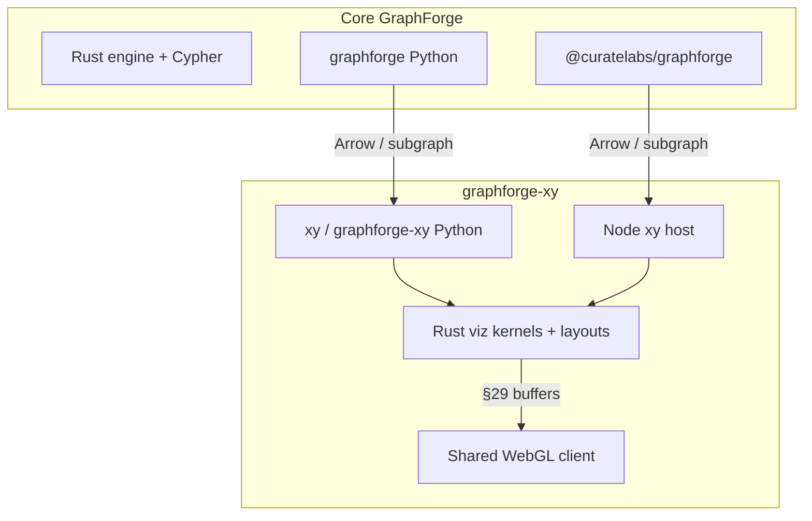

# graphforge-xy — visualization extension of GraphForge

**Status:** product positioning. This repository (`CurateLabs/graphforge-xy`)
is a fork of [reflex-dev/xy](https://github.com/reflex-dev/xy) intended as the
**charting / data-viz extension** of core
[GraphForge](https://github.com/CurateLabs/graphforge)
([docs](https://docs.graphforge.sh/)).

It does **not** replace GraphForge’s embedded openCypher engine, storage,
ontology, or analyst verbs. It visualizes graph-shaped (and general) data for
the same Python and Node hosts GraphForge already ships.

---

## 1. Split of responsibility

| Concern | Owns it |
|---|---|
| Graph store, openCypher, Parquet projects, Arrow query results, analyst verbs, algorithms | **Core GraphForge** (Rust + thin Py/Node bindings) |
| Everyday + large-data charts (scatter, line, …) and **graph data visualization** (node–link layouts, WebGL, encodings, explore interaction) | **graphforge-xy** (this repo) |
| Shared dual-host expectation | Both: Python and Node thin hosts over Rust; identical semantics |

---

## 2. Why Python ↔ Node parity here

Core GraphForge already projects one Rust engine through Python (PyO3) and
Node (N-API). The viz extension **must match that host matrix** for all chart
types so a GraphForge user does not lose charts when they switch languages.

Contract details: [host-parity.md](host-parity.md).

GraphForge’s analysis stays in GraphForge; XY does not reimplement Cypher,
PageRank, community detection, etc. Plot attributes or subgraphs returned from
GraphForge (or convenience adapters like NetworkX) — see
[graph-fork-requirements.md](graph-fork-requirements.md).

---

## 3. Priority and quality bar

**Graph data viz is the core feature** of this extension — the reason
graphforge-xy exists beside GraphForge. It is not the only first-class
surface.

| Rule | Meaning |
|---|---|
| Core feature | Node–link graph charts on GraphForge data: layouts, WebGL, encodings, explore interaction ([graph-fork-requirements.md](graph-fork-requirements.md)) |
| Equal class | Every other chart type (scatter, line, bar, heatmap, …) MUST keep the same **first-class API feel** and **speed** contract as upstream xy / as the graph mark — no “sidecar” or degraded path for non-graph charts |
| Equal hosts | Python and Node parity for **all** chart types ([host-parity.md](host-parity.md)), matching GraphForge’s matrix |
| Integration | Primary graph ingest from GraphForge Arrow / node–edge exports; NetworkX only as plotting convenience |

**Speed / feel (all marks, including graph):**

- Declarative composition API with shared defaults and styling.
- Rust kernels + §29 binary transport + WebGL client (no JSON geometry).
- Screen-bounded work on interaction; recorded LOD/layout decisions (§28).
- Notebook, app, and static export paths that do not demote non-graph charts.

Delivery may **sequence** graph first, but must not ship a product where
non-graph charts feel slower, thinner, or second-class relative to graph or to
upstream xy.

---

## 4. Non-goals for this extension

- Forking or re-hosting the GraphForge engine inside xy.
- Becoming a Cytoscape/vis-network/Ogma product clone (editors, investigation
  chrome, analysis UI).
- Requiring GraphForge at import time for non-graph charts (soft dependency /
  adapter for graph ingest).
- Treating non-graph charts as optional leftovers or lowering their perf bar
  to fund graph work.
