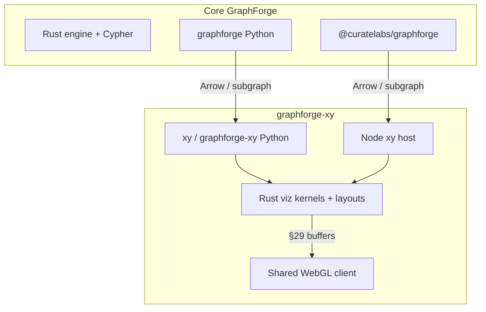

# graphforge-xy — visualization extension of GraphForge

**Status:** product positioning. This repository (`CurateLabs/graphforge-xy`)
is a fork of [reflex-dev/xy](https://github.com/reflex-dev/xy) intended as the
**charting / data-viz extension** of core
[GraphForge](https://github.com/CurateLabs/graphforge)
([docs](https://docs.graphforge.sh/)).

It does **not** replace GraphForge’s embedded openCypher engine, storage,
ontology, or analyst verbs. It visualizes graph-shaped (and general) data for
the same Python and Node hosts GraphForge already ships.

---

## 1. Split of responsibility

| Concern | Owns it |
|---|---|
| Graph store, openCypher, Parquet projects, Arrow query results, analyst verbs, algorithms | **Core GraphForge** (Rust + thin Py/Node bindings) |
| Everyday + large-data charts (scatter, line, …) and **graph data visualization** (node–link layouts, WebGL, encodings, explore interaction) | **graphforge-xy** (this repo) |
| Shared dual-host expectation | Both: Python and Node thin hosts over Rust; identical semantics |

---

## 2. Why Python ↔ Node parity here

Core GraphForge already projects one Rust engine through Python (PyO3) and
Node (N-API). The viz extension **must match that host matrix** for all chart
types so a GraphForge user does not lose charts when they switch languages.

Contract details: [host-parity.md](host-parity.md).

GraphForge’s analysis stays in GraphForge; XY does not reimplement Cypher,
PageRank, community detection, etc. Plot attributes or subgraphs returned from
GraphForge (or convenience adapters like NetworkX) — see
[graph-fork-requirements.md](graph-fork-requirements.md).

---

## 3. Priority

1. **Main need:** core **graph data visualization** on top of GraphForge data
   (node–link mark, layouts, WebGL, encodings, read/explore).
2. **Platform:** keep full XY chart breadth with Python↔Node parity so the
   extension is a complete charting surface for GraphForge apps/notebooks, not
   a graph-only sidecar.
3. **Integration:** first-class ingest from GraphForge Arrow / node–edge
   exports; optional NetworkX only as a plotting convenience.

---

## 4. Non-goals for this extension

- Forking or re-hosting the GraphForge engine inside xy.
- Becoming a Cytoscape/vis-network/Ogma product clone (editors, investigation
  chrome, analysis UI).
- Requiring GraphForge at import time for non-graph charts (soft dependency /
  adapter for graph ingest).
