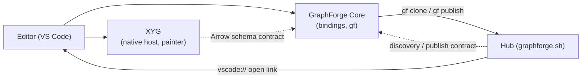

# GraphForge component boundaries: Core, XYG, editor, and Hub

**Status:** Accepted (2026-10-03). Public record: GraphForge ADR 0054.

> **Shared GraphForge decision, public revision 1.** Curate Labs maintains this text in one place and publishes it unchanged to [graphforge](https://github.com/CurateLabs/graphforge/blob/main/docs/adr/0054-product-component-boundaries.md), [xyg](https://github.com/CurateLabs/xyg/blob/main/spec/design/graphforge-product-boundaries.md), [graphforge-vscode](https://github.com/CurateLabs/graphforge-vscode/blob/main/docs/engineering/PRODUCT_BOUNDARIES.md), and the Hub repository. Do not edit this copy: changes are made at the source and re-published to every repository.

## Context

GraphForge ships as four components that grew their boundaries separately:

| Component | Role |
|---|---|
| **GraphForge Core** | Native Rust engine with Python and Node bindings and the `gf` CLI. Owns storage, canonical Arrow result schemas, portable project packages, Versions and lineage, and the Hub wire protocol with its client (`gf clone`, `gf publish`). Execution stays native (GraphForge ADR 0027). |
| **XYG** | Rust visualization engine with Python, Node-native, and browser-WASM hosts and a TypeScript painter. It turns typed GraphForge results plus explicit intent into scenes, images, and exports. |
| **Editor** | The VS Code / Open VSX extension. Analysts and agents run queries and analyst verbs and visualize results in it. |
| **Hub** | graphforge.sh. It gives Projects a stable identity and serves them for discovery and cloning. It runs no GraphForge computation. |

Without a written boundary, each component drifted toward re-implementing its
neighbours. Visualization specs carried renderer details no other host could
read. A result-schema mapping was authored by a consumer instead of the
component that interprets it. Protocol logic was copied into clients. And it was
unclear what the Hub should store.

## Decision

### 1. One owner per concern

- **Core computes and moves data.** It owns graph semantics, result schemas,
  project and package formats, Versions and lineage, compatibility declarations,
  and the Hub protocol including its client. It depends on no other component.
- **XYG turns results into pictures.** It owns composition intent, the mapping
  from result schemas to visualizations, layout, scenes, painting, and image
  export. It depends on Core only as a data contract (Arrow schemas and
  metadata), never as code.
- **The editor is the workbench.** It captures analyst and agent intent,
  orchestrates Core and XYG, and owns the editor experience and its agent command
  surface. It never re-implements engine, visualization, or Hub-protocol
  behaviour.
- **The Hub gives Projects identity, distribution, and discovery.** It serves
  bytes Core produced and renders pages from summaries Core produced. It never
  executes GraphForge queries.

### 2. Dependencies point one way

Solid arrows are code dependencies; dotted arrows are contract-only. The Hub
reaches the editor only through a link the user clicks. The editor reaches the
Hub only through Core.

### 3. Native GraphForge data at an exact Version is the unit of exchange

Anything that crosses a component boundary is GraphForge data, identified by
Core's identities: package digest, Version, and generation. Only Core moves
Projects between machines. Clients invoke Core to clone, publish, export, and
import; no client speaks the Hub protocol itself.

### 4. Every contract has exactly one owner

| Contract | Owner | Consumers prove conformance with |
|---|---|---|
| Project format, portable packages, Versions and lineage | Core | Core fixtures and reopen tests |
| Canonical Arrow result schemas and algorithm descriptors | Core | Real engine fixtures |
| Compatibility declarations (which data and results a release reads) | Core, with XYG for result schemas | Core and XYG release tests |
| Hub discovery and publish protocol | Core | The Rust conformance corpus |
| Composition intent, result-to-visualization mapping, scenes, image export | XYG | XYG fixtures; XYG CI consumes Core's result-schema corpus |
| Editor commands and the `vscode://` open link | Editor | Editor integration tests |
| Hub pages and catalog | Hub | Hub tests |

### 5. The Hub stores only native GraphForge data

The Hub is not a general file store. A Project package carries only content
GraphForge Core defines, validates, and versions: graph data, ontology,
knowledge and evidence (including Core Artifacts with lineage), Project
metadata, and research lineage. Portable packages never carry opaque
non-native files.

Non-native content is handled differently:

- **Visualization previews** are the one non-native thing the Hub shows. They
  travel in a **closed preview channel**, not in the package. That channel is
  typed (PNG and SVG only), bounded (count and size limits), and attached to one
  exact immutable Version. Core's publish contract declares it, Core validates
  it, and the Hub serves it as images.
- **Saved queries** are published only as native Core objects, if Core defines
  one for them. Otherwise they stay local.
- **Notebooks, apps, visualization intent documents, and saved result
  snapshots** are never published to the Hub. They belong in the analyst's own
  source control next to the Project.

### 6. A visualization is published as a PNG and SVG pair

- Locally, a saved visualization is an XYG-owned intent document that the editor
  can reopen and edit. It records the intent, references to source results by
  digest, and the Version it was computed from. It has no renderer or
  host-specific fields and no machine-local paths. Scenes are never persisted.
- When published, a visualization is the **PNG and SVG pair** that XYG's static
  export produces from one composition. SVG is for fidelity and scaling; PNG is
  for thumbnails and contexts that cannot render SVG. Because intent documents
  are never published, their format can keep evolving before v1 without
  stranding published Projects.
- **Plain graphs follow established practice.** A Cypher query that returns
  nodes and relationships gets a sensible property-graph view with no analytical
  layer and no configuration:
  - a deterministic force-directed layout;
  - nodes coloured by label, with labels taken from a name-like property and
    falling back to identity;
  - directed edges with arrows and relationship types;
  - correct self-loops and parallel edges;
  - level-of-detail for large graphs.

  XYG owns these defaults so every host draws the same graph.

### 7. Where things run

- **Core** runs natively and locally: in the editor host, a notebook, or `gf`.
  It never runs on the Hub or in a browser.
- **XYG** composes on its native host inside the editor; the editor's webview
  only paints. The WASM host serves browser contexts within its size limits.
- **The editor** is desktop-only (local and remote extension hosts). It does not
  run in browser-only editors, because Core is native-only.

### 8. Version compatibility belongs to Core and XYG

Whether a result can be visualized is decided between Core and XYG.

1. Core stamps every result with its algorithm and result-schema version, and
   publishes compatibility declarations.
2. XYG checks those stamps against its own mapping while composing, and fails
   with a stable code when it does not support them.
3. The editor and the Hub implement no handshake. They only surface the error
   and its next action.

The editor pins exact Core and XYG versions per release, so the default runtime
is always a supported pair.

### 9. No backward compatibility before v1

Before GraphForge v1, data runs only on the Core version that wrote it. Core
refuses data from another version with a stable error rather than guessing.

- Every published Version declares the exact Core version that produced it.
- The Hub shows that version, and clients name it when they refuse.
- Analysts open a package with the matching Core version, for example through
  the editor's engine-version setting or a matching Python environment.
- A data fix-up feature that upgrades older data is planned but not yet
  available. Until it exists, no component may claim to read older data.

### 10. Editor and Hub meet only through Core and a link

- **Open from the Hub.** The Hub's Open tab links to
  `vscode://curatelabsai.graphforge/clone?repository=<owner>/<repo>[&ref=<branch>][&version=<uuid>]`.
  The editor confirms with the user, runs Core's `gf clone`, and opens the
  Project.
- **Publish from the editor.** The editor invokes Core's `gf publish`. Core owns
  the credential. What gets published is native data plus any explicitly
  selected previews. Nothing is published by default.
- **No direct calls.** There are no direct calls between editor and Hub, and no
  editor-specific Hub endpoints.

## Consequences

- Each component can evolve behind its own contract. The Hub cannot become a
  general file store, and pre-v1 visualization formats never become archived
  public formats.
- Published Projects show their visual results as images, with no compute on the
  Hub and no visualization engine in the Hub.
- Version mismatches fail loudly at their owner (Core for data, XYG for results)
  instead of degrading silently in a client.
- Until data fix-up exists, analysts sometimes need a specific Core version to
  open a published Project. The version is always declared and shown.
- Hosted computation stays possible later, behind Core's contracts, without
  changing this ownership map.

## Options considered

1. **One owner per contract, with thin clients (chosen).**
2. **The Hub as a service backbone**, hosting computation and rendering, with
   editors syncing through a Hub API. This would give richer web previews.
   Rejected for now: it contradicts native execution (GraphForge ADR 0027) and adds
   authentication, transport, and operating cost without demonstrated demand.
3. **The editor as integration centre**, owning its own visualization format and
   a copy of the Hub protocol. Rejected because it duplicates protocols and
   creates formats no other host can read.
