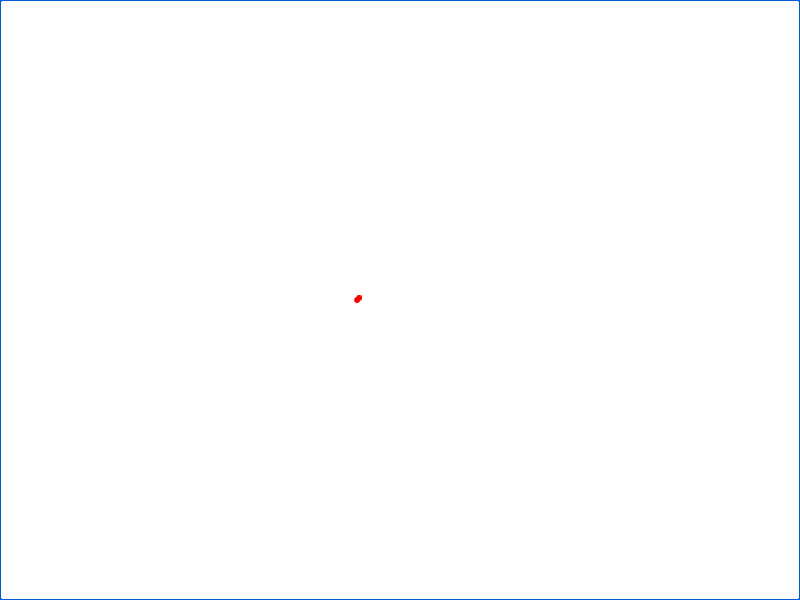

# Trusted native geographic pointer and wheel input

The existing host view now routes trusted primary-pointer dragging and vertical
wheel input through Rust camera commands3/4. Browser code transports screen
deltas and input revisions; Rust applies projection, wrapping, polar and zoom
limits. Each accepted sample waits for the existing programmatic update chain.
There are at most16 ordered gesture samples, including active work. They are
not summed, so Rust camera policy applies to each accepted sample. Overflow
reports one alert and rejects further samples until credit returns.

`browser.jsonl` records the actual Chromium155 journey and27 preparation requests:
synthetic input cannot issue work; real dragging uses opposite deltas scaled to
the authored CSS viewport; keyboard/wheel input waits for a held programmatic
update; successive wheel targets use the latest accepted zoom. Rust rejects an
out-of-range zoom without changing old paint, then accepts the next valid input.
A source-read failure also preserves paint and permits higher-revision recovery.
The held-response burst proves16 samples and one overflow alert. Closing during
pointer capture prevents another request, settles the active candidate and
restores the prior touch-action setting. Constructor registration failure
restores style and removes listeners before throwing, with no native request.

`existing-five-view.jsonl` retains the unchanged five-small-view recovery proof.
`independent-browser.jsonl` records the independent reviewer's actual journey;
the final fixture adds optional screenshot capture without changing production
behavior. `source-sha256.json` and `environment.json` pin source, fresh client and
native artifact. The owned editable setup rebuilt native Rust from source
identical to the reviewed90149f0c core; native ABI383 and runtime limits remain.



The screenshot is the actual800×600 retained fixture after accepted input. Its
small red points are the original source marks, without an inferred basemap.
This proves input/lifecycle behavior, not a massive interaction threshold,
touch/pen behavior, every wheel delta mode or all-host pointer journeys. Wheel
zoom uses the accepted camera center; cursor-centered zoom remains separate.
The report does not establish a competitor performance win.

Reproduce from this source checkout:

```sh
uv sync --extra reflex --group dev
npm ci
npm ci --prefix packages/xy-node
node js/build.mjs
export XYG_NATIVE_LIB="$PWD/target/release/libxyg_core.dylib" # .so on Linux
export XYG_CHROMIUM="/Applications/Google Chrome.app/Contents/MacOS/Google Chrome"
XYG_GEO_POINTER_SCREENSHOT=/tmp/geo-pointer.png node tests/browser/geo_live_pointer_test.mjs
node tests/browser/geo_live_host_test.mjs
python3 scripts/verify_ci_workflow.py
python3 scripts/verify_ownership.py
```

The existing Chromium live-host CI step runs both bounded fixtures; there is no
additional platform job or hosted performance gate.
