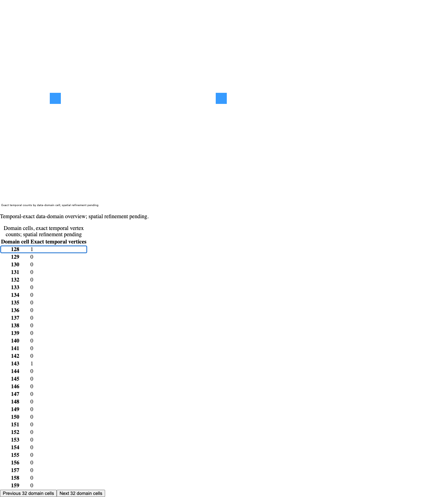

# Public browser temporal overview checkpoint

The public `XygGeographicChart.fromOverview` route paints a privately issued
temporal-domain frame through the existing Rust retained painter. The small
fixture uses three canonical points, full-u64 feature IDs and full-i64 interval
boundaries. It uses two actual Workers, an external bounded page store, ordinary
WebGL2 and the existing application-owned MapLibre custom layer. This is an
implementation checkpoint pending integration, not #50/#39/M6 closure.

`browser.json` is the raw final Chromium result. The independent parent source
review also returned GREEN; `independent-browser.json` and its unchanged raw log
record a separate Chromium execution on the same frozen source and artifact. Both paint paths produce
`[55,155,255,255]` at the measured domain-cell pixel. The companion displays at
most 32 of 256 domain cells and exact-u64 temporal vertex counts. The nonfinal
notice is visible in both Scene paint and the companion. The screenshot records
the accepted ordinary view with focused cell 128 and counts 1 at cells 128/143:



The executable controls cover foreign Workers with colliding handles, forged
lookalike issuers, mutable public and underlying dispatch replacement, producer
checks after a queue wait, private count snapshots, controller Data independent
of caller `index.current`, source/index disposal, initial unpublished counts,
bounded focus/paging, observer failures, 16 serial accepted updates, overflow,
same-Index busy rejection, aborted callback loans and exact ACK settlement,
borrowed handoff failure, retryable disposal and unknown allocation confirmations
preserving old paint and table. No external requests, page errors or CSP
violations occurred. The generic retained regression also passed, including its
existing five painted views; that result does not establish five overview views.

`artifact-inputs.json` records 197 tracked Rust/Cargo/.cargo/vendor/toolchain/build
inputs checked byte-for-byte against both the owner and artifact producer trees.
The actual borrowed WASM SHA is
`f5c3cd1f86f35445bf72c445ddf603f6f85a3b4a5c6abe6b312209908f86c469`
(1,468,284 raw bytes; 603,987 gzip level 6 bytes). The paired native artifact is
recorded for provenance but was not executed by this browser fixture. The
artifact source freeze is `12c0d096`; typed owner ancestry is
`55d371551b589e55a9a409a0a38b91f7a984a094`. `source-sha256.json` binds the exact
product modules and fixture; `environment.json` binds the generated bundle,
Worker and WASM hashes. Generated bundles remain untracked.

From this checkout, after installing the repository's pinned npm dependencies:

```bash
node js/build.mjs
# Use a standard packaged WASM built from the exact current Rust/build inputs.
# This run borrowed the byte-matched producer artifact after build cleared dist:
cp /Users/davidspencer/.t3/worktrees/xyg/t3code-m6-geooverviewmembership/packages/xy-client/dist/xyg-wasm.wasm packages/xy-client/dist/xyg-wasm.wasm
XYG_CHROMIUM='/Applications/Google Chrome.app/Contents/MacOS/Google Chrome' \
XYG_OVERVIEW_CONTROLLER_REPORT=/tmp/overview-browser.json \
XYG_OVERVIEW_CONTROLLER_SCREENSHOT=/tmp/overview-browser.png \
node scripts/geo_overview_controller_smoke.mjs
XYG_CHROMIUM='/Applications/Google Chrome.app/Contents/MacOS/Google Chrome' \
XYG_GEO_RETAINED_REPORT=/tmp/retained-regression.json \
node scripts/geo_retained_wasm_smoke.mjs
python3 scripts/verify_ownership.py
uv run --with pre-commit pre-commit run --all-files
uv run ruff check .
uv run ruff format --check .
```

The producer copy is valid only after verifying input equality; otherwise build
and package the current source normally. Set `XYG_CHROMIUM` to the local browser
path. The server allows only local fixture/bundle/Worker/WASM assets under strict
CSP; it supplies no provider or network tile data. Logs and the raw retained
regression are committed beside this file. The client-build log has ANSI color
escapes and trailing whitespace removed; warning text and outcomes are retained. The initial missing-default-Playwright
binary attempt was corrected by using the explicit installed Chrome path; it
did not execute the fixture.

This is small correctness and lifecycle evidence under uncontrolled concurrent
development load. It contains no competitor timing, small-to-massive performance
win, five-overview-view capacity result or final camera-space refinement claim.
Counts remain temporal-exact/data-space/nonfinal (flags3); domain ordinals are not
GeoLodKeys or feature IDs. Domain membership, selected overview, durable recovery
of unknown 27/28/29 allocations and an accepted-frame public browser freeze/export
wrapper remain open. Six native formats and trusted raw Worker XYGXv4 freeze
remain separately proved by the painter/snapshot slice. The CPU quota scope is
live owned bytes per WASM module, excluding OS RSS, committed linear memory,
GPU/DOM and arbitrary application copies.
